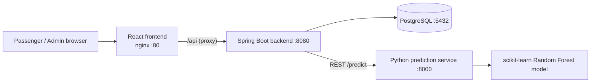
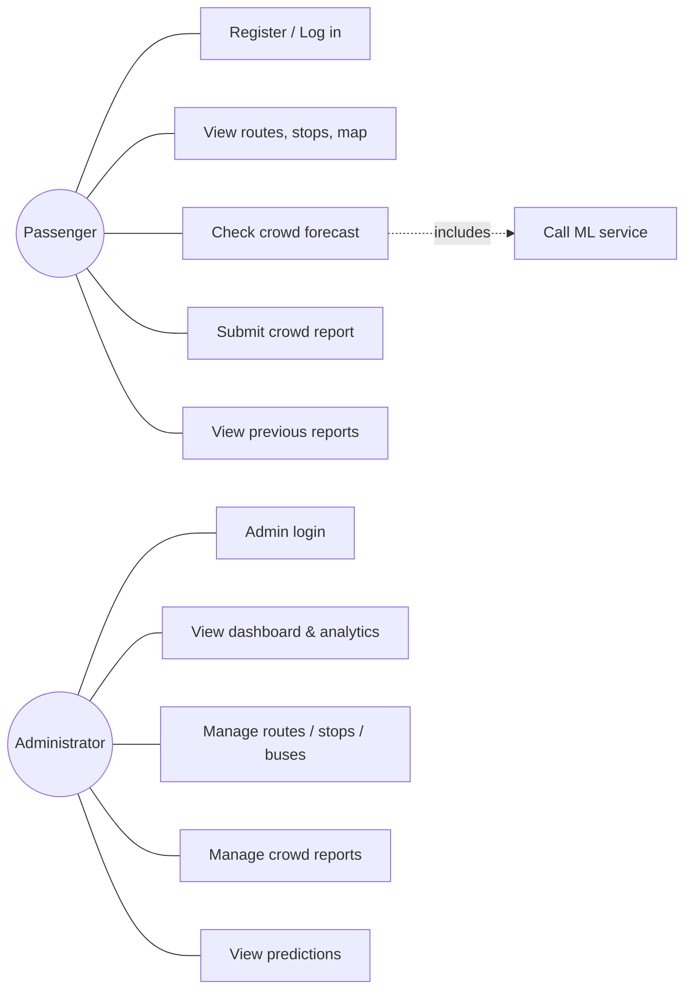
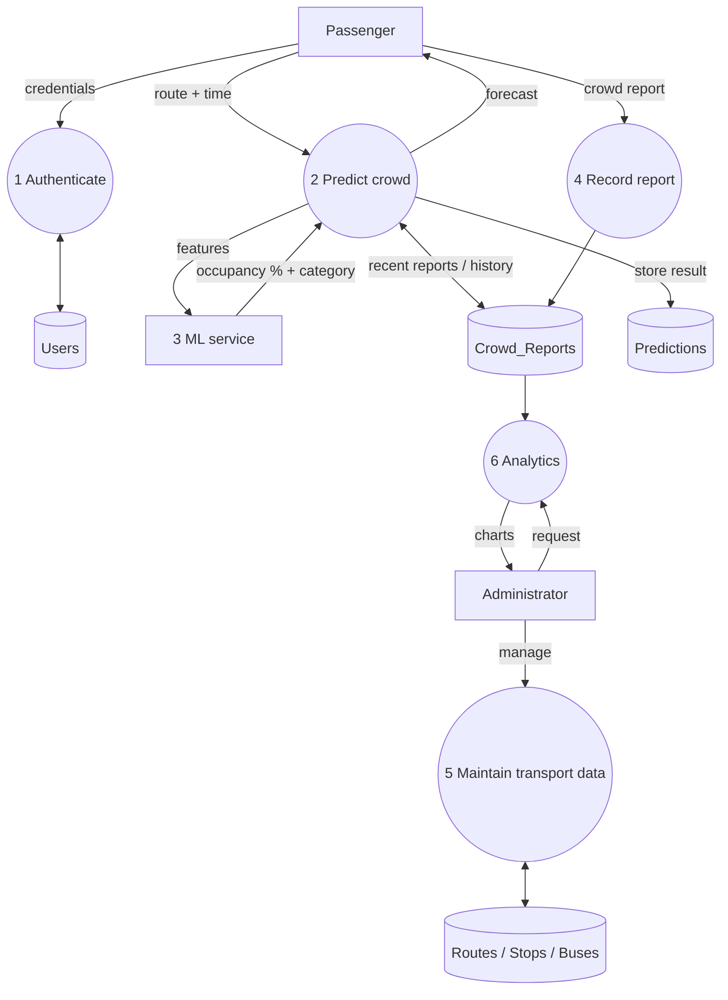
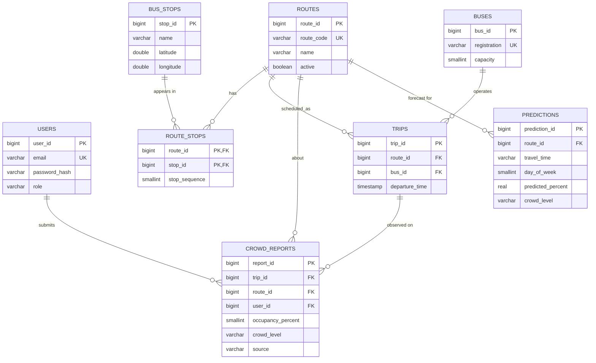

# Diagrams (Mermaid – render automatically on GitHub)

## System architecture

```mermaid
flowchart LR
  U[Passenger / Admin browser] --> F[React frontend<br/>nginx :80]
  F -- "/api (proxy)" --> B[Spring Boot backend :8080]
  B --> D[(PostgreSQL :5432)]
  B -- "REST /predict" --> M[Python prediction service :8000]
  M --> S[scikit-learn Random Forest model]
```

## Use-case diagram

```mermaid
flowchart LR
  P((Passenger)) --- U1[Register / Log in]
  P --- U2[View routes, stops, map]
  P --- U3[Check crowd forecast]
  P --- U4[Submit crowd report]
  P --- U5[View previous reports]
  A((Administrator)) --- A1[Admin login]
  A --- A2[View dashboard & analytics]
  A --- A3[Manage routes / stops / buses]
  A --- A4[Manage crowd reports]
  A --- A5[View predictions]
  U3 -.includes.-> ML[Call ML service]
```

## Data-flow diagram (level 1)

```mermaid
flowchart TD
  P[Passenger] -- credentials --> P1((1 Authenticate))
  P1 <--> DB1[(Users)]
  P -- route + time --> P2((2 Predict crowd))
  P2 -- features --> ML[3 ML service]
  ML -- occupancy % + category --> P2
  P2 <-- recent reports / history --> DB2[(Crowd_Reports)]
  P2 -- store result --> DB3[(Predictions)]
  P2 -- forecast --> P
  P -- crowd report --> P4((4 Record report))
  P4 --> DB2
  AD[Administrator] -- manage --> P5((5 Maintain transport data))
  P5 <--> DB4[(Routes / Stops / Buses)]
  AD -- request --> P6((6 Analytics))
  DB2 --> P6
  P6 -- charts --> AD
```

## ER diagram

```mermaid
erDiagram
  USERS ||--o{ CROWD_REPORTS : submits
  ROUTES ||--o{ ROUTE_STOPS : has
  BUS_STOPS ||--o{ ROUTE_STOPS : "appears in"
  ROUTES ||--o{ TRIPS : scheduled_as
  BUSES ||--o{ TRIPS : operates
  TRIPS ||--o{ CROWD_REPORTS : "observed on"
  ROUTES ||--o{ CROWD_REPORTS : about
  ROUTES ||--o{ PREDICTIONS : "forecast for"
  USERS { bigint user_id PK  varchar email UK  varchar password_hash  varchar role }
  ROUTES { bigint route_id PK  varchar route_code UK  varchar name  boolean active }
  BUS_STOPS { bigint stop_id PK  varchar name  double latitude  double longitude }
  ROUTE_STOPS { bigint route_id PK,FK  bigint stop_id PK,FK  smallint stop_sequence }
  BUSES { bigint bus_id PK  varchar registration UK  smallint capacity }
  TRIPS { bigint trip_id PK  bigint route_id FK  bigint bus_id FK  timestamp departure_time }
  CROWD_REPORTS { bigint report_id PK  bigint trip_id FK  bigint route_id FK  bigint user_id FK  smallint occupancy_percent  varchar crowd_level  varchar source }
  PREDICTIONS { bigint prediction_id PK  bigint route_id FK  varchar travel_time  smallint day_of_week  real predicted_percent  varchar crowd_level }
```
